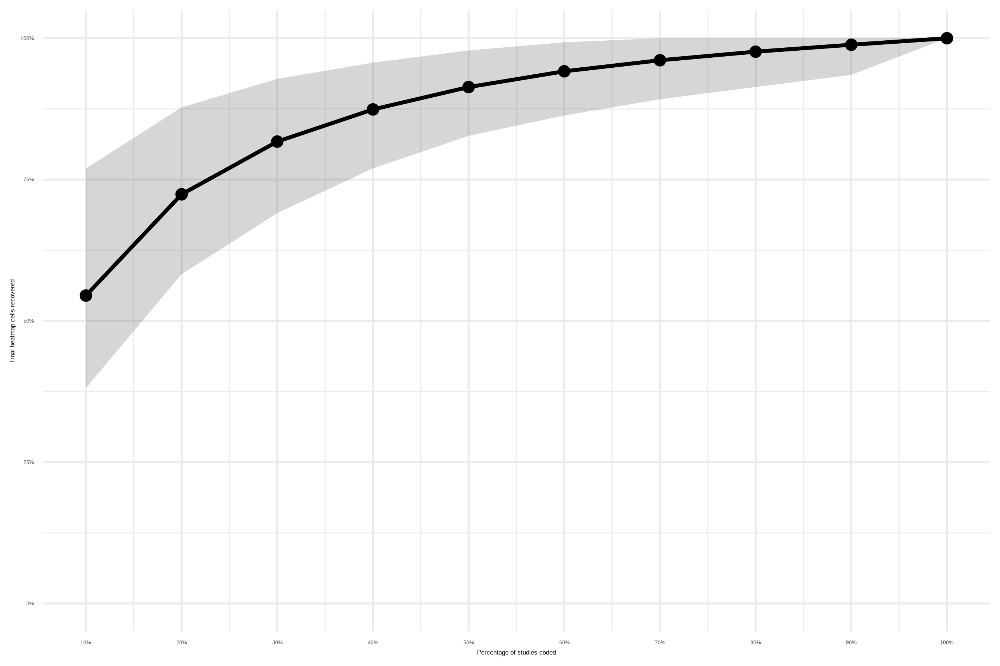
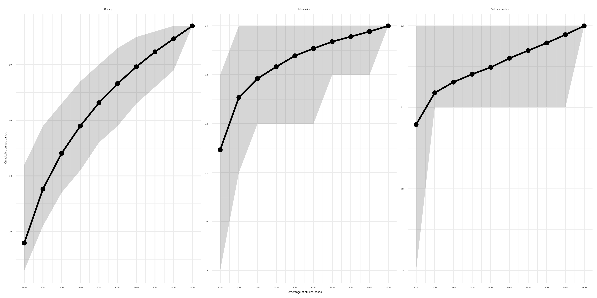
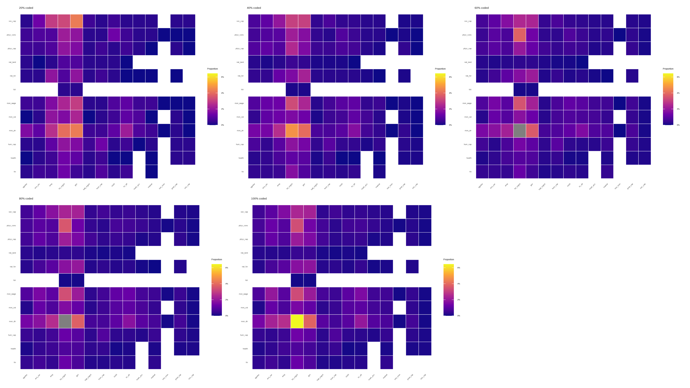

# Random subsampling: an approach to mapping very large evidence bases

## Overview

Systematic maps are increasingly used to characterise large and complex
evidence bases. However, the rapid growth of scientific literature means
that comprehensive mapping exercises can require substantial time and
resources.

This repository accompanies the manuscript:

Random subsampling: an approach to mapping very large evidence bases

[Neal R Haddaway](https://github.com/nealhaddaway)

[Matthew Grainger](https://github.com/DrMattG)

[Sini Savilaakso](https://github.com/SSavilaakso)

The project explores whether random subsampling can recover the broad
structure of an evidence map before all studies have been screened and
coded. Rather than processing the entire evidence base before producing
outputs, studies are randomly allocated to subsets and analysed
progressively. This allows evidence maps to be generated even when time,
funding, or staffing constraints prevent completion of the full project.

### Why this matters

Large systematic maps may contain tens of thousands of records and
require months or years to complete. When projects are interrupted or
resources are exhausted, substantial effort may be invested before any
useful outputs are produced.

Random subsampling offers a potential alternative by:

- Producing usable evidence maps earlier in the review process.

-Reducing delivery risks associated with large commissioned projects.

- Allowing evidence clusters and knowledge gaps to be identified sooner.

- Supporting adaptive project planning and resource allocation.

-Providing a framework for investigating information saturation.

# Conceptual workflow

Search → Deduplicate → Randomise studies

↓

Split into blocks

↓

Screen and code first subset

↓

Produce preliminary map

↓

Evaluate information saturation

↓

Continue if additional resolution is required

## Example findings

Using a completed systematic map as a retrospective case study:

- More than 70% of intervention–outcome structure was recovered after
  coding approximately 20% of studies.

- More than 80% of intervention–outcome structure was recovered after
  coding approximately 30% of studies.

- More than 90% of intervention–outcome structure was recovered after
  coding approximately 50% of studies.

- Outcome categories reached information saturation rapidly.

- Additional coding primarily increased evidence density within existing
  clusters rather than fundamentally altering map structure.

These results are intended as an illustration of the concept rather than
evidence for a universally appropriate sampling fraction.

## Key figures

Recovery of evidence-map structure

Information saturation

Evolution of intervention–outcome heatmaps

### Abstract

Systematic mapping is essential for cataloguing evidence, but the
near-exponential growth in academic publishing, especially in
environmental science, has made comprehensive mapping increasingly
resource-intensive. While Artificial Intelligence is often proposed as a
solution, it frequently struggles with the broad, non-core topics
characteristic of expansive maps. This paper introduces a novel “random
subsampling” methodology designed to produce reliable evidence syntheses
when time or budgets are limited. The approach involves breaking
deduplicated search results into random blocks—such as 20%
increments—and processing each block entirely, from screening to data
extraction, before moving to the next. This “map-first” strategy allows
for a representative, albeit lower-resolution, assessment of the
evidence base if project activities must terminate prematurely. We
discuss the use of information saturation curves to determine sufficient
resolving power. We validate the method through case studies, including
aquaculture impacts and biodiversity monitoring in protected areas,
alongside a real-world simulation identifying patterns across an
intervention-outcome heatmap. Beyond managing workload, random
subsampling offers significant risk-reduction benefits for contractual
delivery and improves project efficiency by allowing for early data
visualisation and refined eligibility criteria. Whilst the method
precludes an immediate transition to a full systematic review without
further targeted screening, it ensures that knowledge gaps and clusters
are identified accurately. We conclude that random subsampling provides
a pragmatic, robust framework for navigating the challenges of “big
literature,” ensuring that evidence maps remain a viable, insightful
tool for researchers and commissioners alike.

### Keywords

Evidence mapping, evidence synthesis, resource constraints, science
policy, evidence informed decision making, scoping reviews

### License

This project is released under the GPL-3.0 licence.
